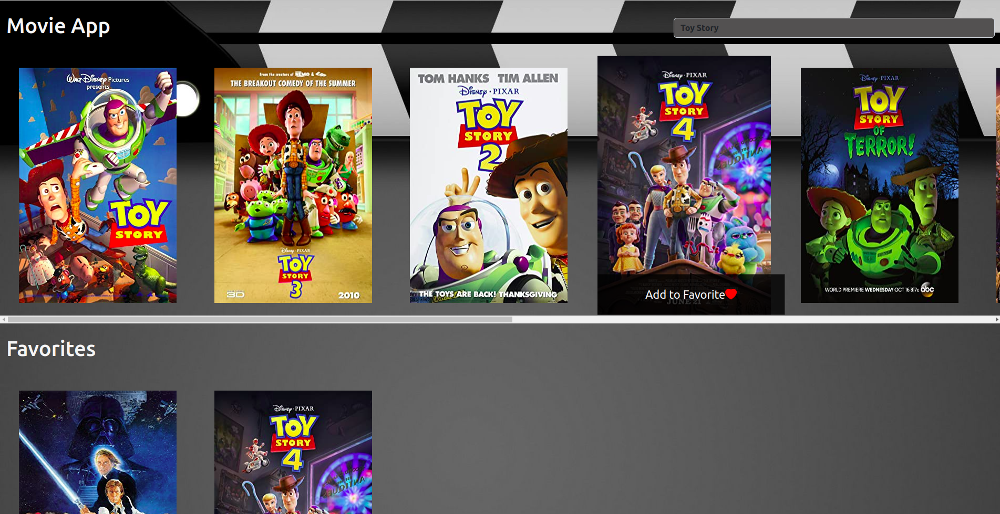

## Periodic Table practice

## About the project:
> This project was created in order to get a better understanding about how to apply React into a project.

- **Description:**
> For this project was required to create a React-App using npx create-react-app, linked to a repository in GitHub.

- **- **Developed with:**
- [x] _React_
- [x] _JavaScript_
- [x] _Css_
- [x] _Bootstrap_
- [x] _Git_

- **Tools:**
- [Visual Studio Code](https://code.visualstudio.com/)

- **Contact:**
GitHub: [erikayanez](https://github.com/) 
